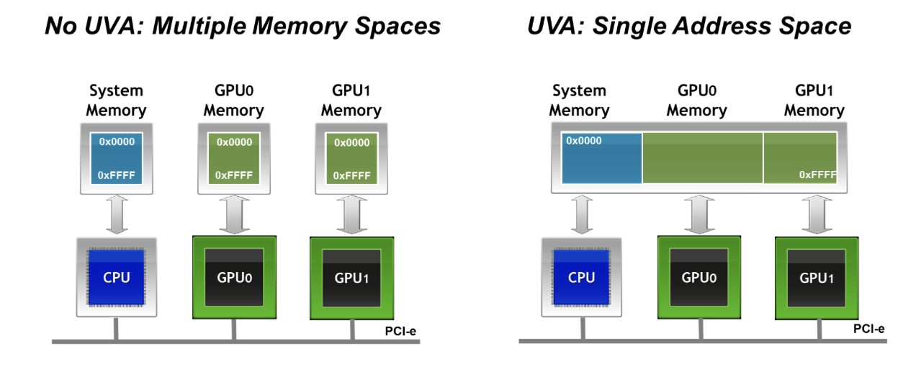

# CUDA-Aware MPI

Relevant Resources:
- [Intro to MultiGPU Programming](https://www.youtube.com/watch?v=bqL1WC3AKNA)
- [Official (old) NVIDIA Blog Post](https://developer.nvidia.com/blog/introduction-cuda-aware-mpi/)

## Summary

### What is MPI?
If you don't already know, MPI is just a library (now a standard) that lets multiple processes communicate. It has APIs for point-to-point messages, as well as collective operations like reductions.

Example MPI program:
```c
#include <stdio.h>
#include <string.h>
#include <mpi.h>

int main(int argc, char *argv[])
{
    char message[20];
    int myrank, tag=99;
    MPI_Status status;

    /* Initialize the MPI library */
    MPI_Init(&argc, &argv);
    /* Determine unique id of the calling process of all processes participating
       in this MPI program. This id is usually called MPI rank. */
    MPI_Comm_rank(MPI_COMM_WORLD, &myrank);

    if (myrank == 0) {
        strcpy(message, "Hello, there");
        /* Send the message "Hello, there" from the process with rank 0 to the
           process with rank 1. */
        MPI_Send(message, strlen(message)+1, MPI_CHAR, 1, tag, MPI_COMM_WORLD);
    } else {
        /* Receive a message with a maximum length of 20 characters from process
           with rank 0. */
        MPI_Recv(message, 20, MPI_CHAR, 0, tag, MPI_COMM_WORLD, &status);
        printf("received %s\n", message);
    }

    /* Finalize the MPI library to free resources acquired by it. */
    MPI_Finalize();
    return 0;
}
```

Compile and run:
```bash
mpicc source.c -o myapp
mpirun -np 4 ./myapp <args>  # launches four instances of the myapp process

# 1 process per GPU!
```

### What is CUDA-Aware MPI?
The idea is that instead of only being able to put host buffers into the MPI calls, we want to insert GPU buffers instead.

Without it, you need to "stage" GPU buffers through host memory like so:

```c
//MPI rank 0
cudaMemcpy(s_buf_h,s_buf_d,size,cudaMemcpyDeviceToHost);
MPI_Send(s_buf_h,size,MPI_CHAR,1,100,MPI_COMM_WORLD);

//MPI rank 1
MPI_Recv(r_buf_h,size,MPI_CHAR,0,100,MPI_COMM_WORLD, &status);
cudaMemcpy(r_buf_d,r_buf_h,size,cudaMemcpyHostToDevice);
```

It's kind of dumb to constantly have to `cudaMemcpy` to the device/host just to use MPI.

With CUDA-aware MPI, you just pass the GPU buffer directly where it is needed:

```c
//MPI rank 0
MPI_Send(s_buf_d,size,MPI_CHAR,1,100,MPI_COMM_WORLD);

//MPI rank n-1
MPI_Recv(r_buf_d,size,MPI_CHAR,0,100,MPI_COMM_WORLD, &status);
```

*That's it! That's what CUDA-aware MPI is all about!*

Benefits of this approach:
- It's easier to work with a CUDA+MPI application
- No staging means we can use *GPUDirect* and GPUDirect RDMA. So we can send data directly from GPU 0's memory to GPU 1's memory, or a NIC.
- It makes for more efficient pipelining (see the old technical blog)

### How do I install, compile, and run CUDA-aware MPI?
1. Ensure your system has a CUDA-capable GPU with updated drivers.
2. Clone OpenMPI tarball
3. tar -xzf openmpi-VERSION.tar.gz
4. cd openmpi-VERSION
5. ./configure --with-cuda=/usr/local/cuda-VERSION
6. sudo make all install
7. Set LD_LIBRARY_PATH so that it includes where openmpi installed the libraries (`/usr/local/lib`).

Now you can run `mpicc` and mpirun.


### More details
- Under the hood this works because of UVA: the addresses are laid out like [-addresses-for-cpu-, -addresses-for-gpu-0-, -addresses-for-gpu-1-, etc.]



