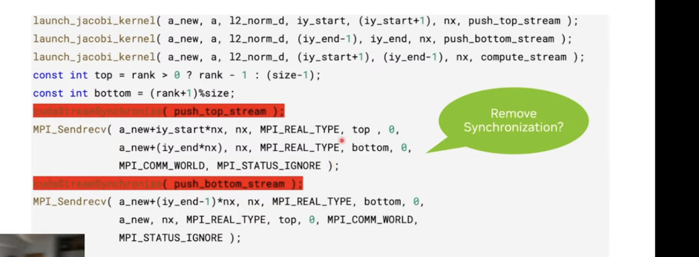

# NCCL

## Summary
NCCL is basically just a library of kernels. These kernels just happen to specifically do data transfer, and they are highly optimized and adapt to your hardware topology.

We *could* just do the data transfer with MPI, but it's not as optimized as NCCL. For example, in the Jacobi kernel, MPI_sendrecv doesn't have a stream argument, i.e. we can't automatically enqueue them onto separate CUDA streams easily.

CUDA-aware MPI primarily uses the *copy engine*, while NCCL primarily uses *load-store instructions*.

As a general rule of thumb, CUDA-MPI is better for P2P tasks, NCCL is better for larger collective operations.




## Writing a NCCL Program
You initialize NCCL by just piggybacking off of MPI: you broadcast the NCCLUid and that's what you need to set everything up. (can use both NCCL and MPI)
```c
MPI_Init(&argc, &argv);
MPI_Comm_size(MPI_COMM_WORLD, &size);
MPI_Comm_rank(MPI_COMM_WORLD, &myrank);

ncclUniqueId nccl_uid;
if (rank == 0) ncclGetUniqueId(&nccl_uid);
MPI_Bcast(&nccl_uid, sizeof(ncclUniqueId), MPI_BYTE, 0, MPI_COMM_WORLD);
MPI_Barrier(MPI_COMM_WORLD);

ncclComm_t nccl_comm;
ncclCommInitRank(&nccl_comm, size, nccl_uid, rank);
// DO YOUR STUFF
ncclCommDestroy(nccl_comm);
MPI_Finalize();
```

- Every rank runs their own process and doesn't know about any of the others: they can only communicate using MPI.

- Hence, they use MPI to broadcast the port, communicator group ID, and IP of rank 0. The NCCL library can't just auto-"find" every other GPU!

- You don't HAVE to use MPI: you could theoretically write the UID to a shared file... or use sockets... or TCP/IP protocol!


- Use `ncclGroupStart()` and `ncclGroupEnd()` around nccl operations you want to aggregate: that way you pay the launch overhead only once. (put around multiple ncclAllReduce calls)

```
ncclGroupStart()
ncclSend and ncclRecvs
ncclGroupEnd()
```

- Streams can have different "priorities" 
- NCCL overlap just gives you increased efficiency

- Literally just MPI, but only on device buffers, and it's stream-aware.